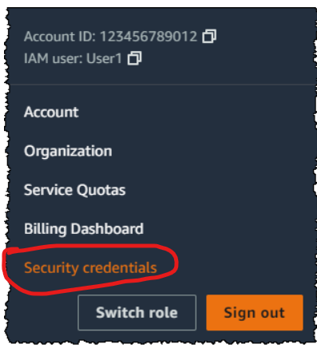

# terraform-aws-rds-provision
This code is applicable for the provisioning of two RDS instances. But you can modify the code in main.tf file as per your requirements.

## Step-1: Install Terraform using following url.
https://developer.hashicorp.com/terraform/tutorials/aws-get-started/install-cli

## Step-2: Install AWS CLI from following url.
https://docs.aws.amazon.com/cli/latest/userguide/getting-started-install.html

## Step-3: Create AWS Access Key in your AWS console
You can use the AWS Management Console to manage the access keys of an IAM user.
To create, modify, or delete your own access keys (console)
 - Use your AWS account ID or account alias, your IAM user name, and your password to sign in to the https://console.aws.amazon.com/iam
 - In the navigation bar on the upper right, choose your user name, and then choose Security credentials.
   
 - To create an access key - <br>
    -> In the Access keys section, choose Create access key. If you already have two access keys, this button is deactivated and you must delete an access key before you can create a new one.
    
    -> On the Access key best practices & alternatives page, choose your use case to learn about additional options which can help you avoid creating a long-term access key. If you determine that your use case still requires an access key, choose Other and then choose Next.
    
    -> (Optional) Set a description tag value for the access key. This adds a tag key-value pair to your IAM user. This can help you identify and update access keys later. The tag key is set to the access key id. The tag value is set to the access key description that you specify. When you are finished, choose Create access key.
    
   -> On the Retrieve access keys page, choose either Show to reveal the value of your user's secret access key, or Download .csv file. This is your only opportunity to save your secret access key. After you've saved your secret access key in a secure location, choose Done.
   
## Step-4: Download the source code in "terraform-aws-rds-provision" directory
For example, you extracted the code to D:\terraform-aws-rds-provision directory

## Step-5: Go to windows console or linux terminal. Go to "terraform-aws-rds-provision" directory. Provide AWS Access Key and Secret Value
```
d:
cd terraform-aws-rds-provision
aws configue
```
Here will ask aws access key and secret value
You need to provide also defult region of aws

## Step-6: Initialize the terraform 
```
terraform init
```
## Step-7: Check changes between runs
```
terraform plan
```
## Step-8: Apply changes to the infrastructure
```
terraform apply
```
Here you will be asked for confirmation, write "yes" if everything looks good.

Now you can check RDS instances in AWS console

## Step-9: Delete the created RDS instances
```
terraform destory
```


